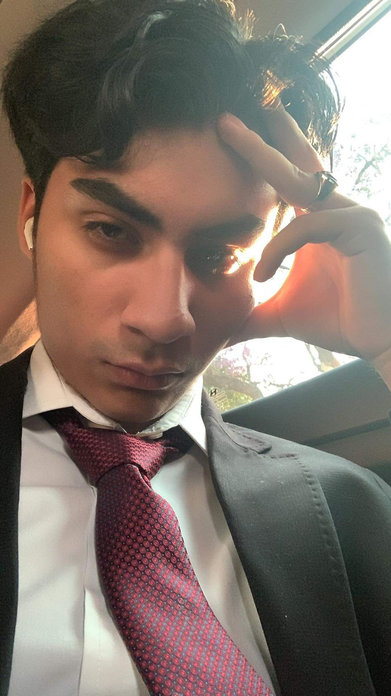

## Bienvenido al perfil de ...

## Acerca de mí
- Actual estudiante de Ingenieria en Ciberseguridad en la universidad Amerike
- Apasionado de los Videojuegos 
- Interesado en el OSINT y el Pentesting

## Habilidades

Estudié con anterioridad en el instituto Politécnico Nacional la carrera de ingeniería en inteligencia artificial durante 4 semestres, además de en la vocacional haberme graduado como técnico en programación. Cuento con conocimientos en C, Java, HTML, PHP y Python, así como en el uso del sistema operativo Linux y en el uso de la consola de comandos. 

## Contacto

Puedes contactarme a través de :

- Email: [rendon.sierra.carlos.alexis@gmail.com]
- Facebook: [https://www.facebook.com/profile.php?id=100006954406169]
- Instagram: [https://www.instagram.com/carlos_rendonsierra/]

Sientete libre de contactarme y revisas mis proyectos <3
